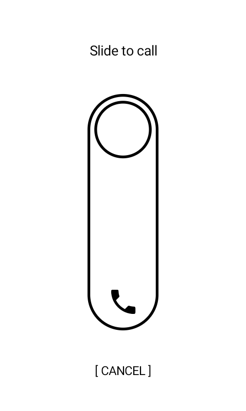
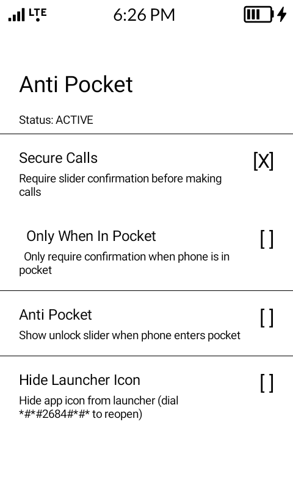
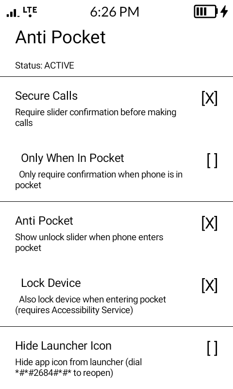

# Anti Pocket

Prevent accidental pocket dials and unauthorized calls.

## Screenshots

<p>
  
  
  
</p>

## Features

- **Secure Calls** - Require slider confirmation before outgoing calls
- **Only When In Pocket** - Only require confirmation when phone is in pocket
- **Anti Pocket Mode** - Show unlock slider when phone enters pocket
- **Lock Device** - Auto-lock when entering pocket (preserves fingerprint unlock)
- **Hide Launcher Icon** - Hide app from launcher (dial `*#*#2684#*#*` to reopen)

## Permissions

- Phone & call permissions for call interception
- Overlay permission for slider display
- Battery optimization exemption for pocket detection
- Accessibility Service (optional) for lock feature

## Build

```bash
./gradlew assembleDebug
```

## License

MIT License - see [LICENSE](LICENSE)
